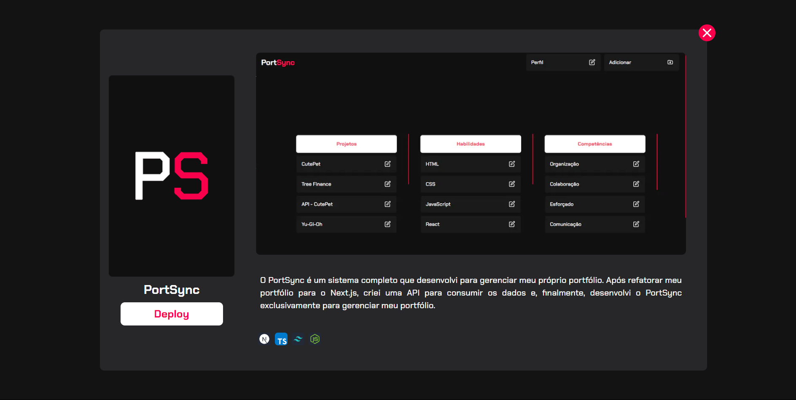

</h1>
   
<h1>WillCode - Contato</h1> 

## Descrição

### "Descubra a magia das rotas dinâmicas do Next.js 13.4! 💫✨ Utilizando minha própria API personalizada para listar todos os meus projetos, consegui criar facilmente diversas rotas estáticas para o meu site. É incrível como essa abordagem simplifica a navegação e melhora a experiência do usuário. Agora, meus visitantes podem explorar meus projetos de forma fluida e interativa!

### O Next.js 13.4 oferece uma variedade de recursos poderosos que tornam a criação de sites dinâmicos uma experiência empolgante. Com as rotas dinâmicas, posso construir páginas personalizadas para cada projeto com facilidade, tudo isso mantendo a velocidade e o desempenho do site.

[Ver Projeto](https://dynamic-routers.vercel.app/)

#

## Layout web

#

 

## 🛠️ Tecnologias

💻 **Front-end**
- [Next.js 13.4](https://nextjs.org)
- [Typescript](https://www.typescriptlang.org)

📚 **Bibliotecas**
- [react-icons](https://react-icons.github.io/react-icons/)

🎨 **Estilização**
- [tailwindcss](https://tailwindcss.com/docs/installation)

🔋 **Versionamento e Deploy**
- [Git](https://git-scm.com)
- [Vercel](https://vercel.com/)

 

⚙️ **Configuranções e Instalações**

Clone do Projeto

    $ git clone https://github.com/renovatt/dynamic-routers.git
Instalando as dependências

    $ npm install

Iniciando o projeto

    $ npm run dev

 

**Como contribuir?**

- Você pode dar suporte me seguindo aqui no GitHub
- Dando uma estrela no projeto
- Criar uma conexão comigo no linkedin fazendo parte da minha networking e curtir o meu projeto.

 

**Autor**
[Wildemberg Renovato de Lima](https://www.linkedin.com/in/renovatt/)